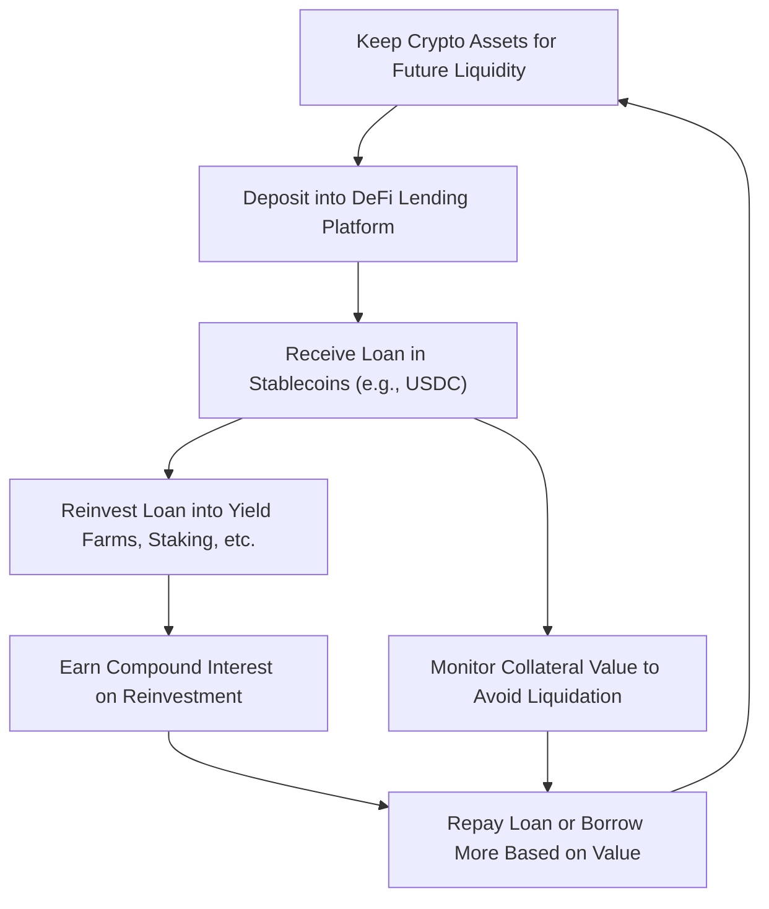

## Understanding "Infinite Banking" with DeFi (Crypto Lending and Borrowing)

If you’re unfamiliar with crypto and blockchain, let me first explain a couple of things. **Crypto** refers to digital money like Bitcoin and Ethereum, while **blockchain** is the technology that powers these digital currencies. Now, let’s get into the concept of **DeFi (Decentralized Finance)**, which is a system that allows you to borrow, lend, or trade assets (like crypto) directly with others, without needing traditional banks.

### What is Infinite Banking?

In the traditional sense, **Infinite Banking** is a strategy where people use their whole life insurance policy as a way to borrow money. They can take out loans against the cash value of their insurance policy, and use that money for other investments or expenses without selling their insurance policy. The key idea here is **access to liquidity** (money) when you need it, **without selling your assets**.

So, how does this concept apply to **crypto** and **DeFi**? That’s what we’re going to explore.

### Infinite Banking in the Crypto World (DeFi)

Let’s imagine that instead of using a whole life insurance policy, you use **crypto** (digital money like Bitcoin, Ethereum, or stablecoins) as your "collateral" (security) to borrow money. This is where the world of **DeFi lending and borrowing** comes into play.

1. **Using Crypto as Collateral**:
   - Just like in Infinite Banking, where you use your life insurance policy as collateral to borrow money, in **DeFi**, you can use your crypto assets as collateral.
   - This means that if you own some Bitcoin, Ethereum, or other types of crypto, you can deposit them into a **DeFi lending platform** and, in return, borrow **stablecoins** (a type of cryptocurrency that’s tied to the value of real-world assets like the U.S. dollar).
   
2. **Access to Liquidity (Money)**:
   - You borrow this money **without selling your crypto assets**. In other words, you can **continue holding** your crypto while accessing the liquidity (cash) you need. This is powerful because you don’t lose out if the value of your crypto rises over time.
   
3. **Reinvesting the Loan for Growth**:
   - Just like in Infinite Banking, where you use borrowed money to invest and grow your wealth, in **DeFi**, you can take the stablecoins you borrowed and **reinvest them** into other opportunities. You could use the money to **earn interest**, participate in **yield farming** (a way of earning rewards), or even **stake your coins** (another form of earning interest) within the crypto ecosystem.
   
4. **Compound Interest**:
   - Imagine you borrow money and then reinvest it to make more money. Over time, this money you’ve reinvested **grows** due to **compound interest**. It’s like earning interest on your interest. This strategy mimics how the cash value in a life insurance policy grows over time.

5. **Repayment Flexibility**:
   - One of the great things about Infinite Banking is that you have the option to pay back your loan when you’re ready, without strict timelines. In the DeFi world, most platforms also offer **flexibility in repayments**, although you need to make sure you have enough collateral so that your position doesn’t get **liquidated** (taken by the platform if the value of your collateral drops too low).

6. **Maintaining Exposure to Crypto Growth**:
   - By borrowing against your crypto, you **avoid selling** it. This means you **continue to benefit** from the price growth of your assets while still having the money you need for other investments.

---

### Visualizing the Process

Let’s now break it down visually with a simple diagram (Mermaid) that shows how this process works. Here’s how it would look:

---

### Key Benefits of DeFi Lending for Infinite Banking

1. **Liquidity Without Selling**: You get access to cash (in the form of stablecoins) but **keep your crypto**. This means that you can borrow money but still hold onto your assets in case their value increases.
   
2. **Flexibility**: The **DeFi lending protocols** (like Aave, Compound, and MakerDAO) offer more flexibility than traditional banks. You have **control over your loan** and can choose when to repay, as long as you manage the collateral ratio properly.

3. **Compound Growth**: By reinvesting the borrowed funds, you can generate compound interest. This means that your crypto investments can grow faster, just like how life insurance policies grow over time.

4. **Continued Exposure to Crypto**: Since you don’t sell your crypto, you **stay exposed to potential gains** in the market, which could be important if the value of your crypto goes up.

---

### Key Risks to Consider

1. **Liquidation Risk**: One of the biggest risks in DeFi is **liquidation**. If the price of your collateral (crypto) drops too much, you may be required to repay the loan quickly, or the platform could sell your assets to repay it for you.
   
2. **Volatility**: Crypto markets are **very volatile**, meaning prices can change rapidly. This could impact how much your collateral is worth at any given time, and make it harder to repay loans if the value drops significantly.

3. **Interest Rate Changes**: Interest rates for borrowing in DeFi can fluctuate, which means you might end up paying more interest than you expected. Keep an eye on these rates to ensure that you’re not paying too much.

---

### Final Thoughts

By combining the concept of **Infinite Banking** with **DeFi**, you can create a powerful strategy for **accessing liquidity without losing ownership of your assets**. It allows you to **borrow money against your crypto** and **use that money for investments** that generate growth over time. Just remember that the **crypto market’s volatility** brings some risks, so it’s important to manage your collateral and monitor your positions carefully.

In the world of DeFi, you're your own bank. You have the **control**, but also the responsibility to ensure that your loans are properly managed to avoid liquidation.

If you're new to crypto, there’s a learning curve, but once you understand how it works, you can use it to your advantage, just like the strategy of Infinite Banking.

# **NOT FINANCE ADVICE!!!**
None of this is financial advice. It's just documentations of things I have learnt over the years.
