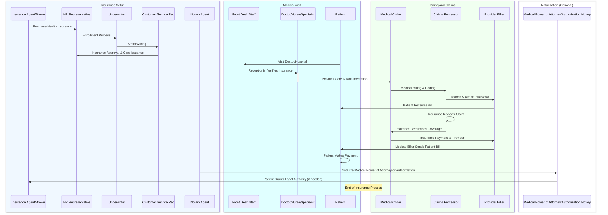

# Complete Guide to Health Insurance and Medical Billing

This guide provides a comprehensive breakdown of how health insurance works from the moment you sign up for a plan all the way to paying your medical bills.
It is aimed towards someone who is trying to understand how healthcare and insurance work together.

## **Step 1: Purchasing Health Insurance**

**Role: Insurance Agent/Broker, HR Representative**

-   **Insurance Agent/Broker**: If you're purchasing insurance on your own, an agent or broker will help you choose the right health insurance plan. They’ll guide you through options and help you find a policy that fits your needs.
-   **HR Representative**: If your employer provides health insurance, the HR representative will help you understand the available plans and guide you through the enrollment process.

Once you decide on a plan, you’ll start the **enrollment process**.

## **Step 2: Insurance Enrollment**

**Role: Underwriter, Customer Service Rep**

-   **Underwriter**: After you enroll in a health plan, an underwriter reviews your application. They look at your health history, any pre-existing conditions, and other risk factors to determine your eligibility for the insurance.
-   **Customer Service Representative**: If you have any questions during the process, the customer service representative can help you understand the terms of your insurance policy and answer any queries you might have.

Once underwriting is complete and you’re approved, you’ll receive your **insurance card**, which allows you to begin using your health benefits.

## **Step 3: Visiting the Doctor or Hospital**

**Role: Front Desk Staff, Doctor/Nurse/Specialist, Patient**

-   **Front Desk Staff**: When you visit a doctor or hospital, the front desk staff will verify your insurance by looking at your insurance card to make sure you're covered for the services you need.
-   **Doctor/Nurse/Specialist**: A medical professional will provide care based on your needs, whether it’s a routine check-up or an emergency treatment. They’ll also document your medical information in your file, including diagnoses and treatments, which is crucial for the billing process.

## **Step 4: Medical Billing and Coding**

**Role: Medical Coder, Claims Processor, Provider Biller**

-   **Medical Coder**: After your visit, a medical coder translates the doctor's notes into a standardized code for insurance billing. These codes are used to represent diagnoses and treatments.
-   **Claims Processor**: The claims processor reviews the information provided and submits a claim to your insurance company for payment. They will ensure that the claim is filed properly and that the medical services are eligible for reimbursement.
-   **Provider Biller**: Once the claim is submitted, the provider biller will follow up with the insurance company to ensure payment is processed.

## **Step 5: Insurance Review and Payment**

**Role: Insurance Claims Processor, Provider Biller**

-   **Insurance Claims Processor**: The insurance company reviews the claim to determine whether it’s covered under your policy. If it’s approved, the insurance company will pay a portion (or all) of the bill directly to the healthcare provider.
-   **Provider Biller**: Once the insurance payment is received, the provider biller will send you the remaining balance, if any. This is the amount you owe after the insurance has paid their portion.

## **Step 6: Receiving the Bill and Making Payment**

**Role: Patient, Provider Biller**

-   **Provider Biller**: After the insurance payment is processed, the provider sends you the bill for any remaining balance that is your responsibility.
-   **Patient**: As the patient, you are responsible for paying the remaining balance. You can make the payment directly to the healthcare provider, either online, by check, or by credit card.

## **Optional: Notarization of Medical Power of Attorney or Authorization**

In some cases, a **Medical Power of Attorney** or other forms of **authorization** may be needed, particularly if you’re incapacitated and need someone else to make medical or financial decisions on your behalf.

**Role: Notary Agent, Medical Power of Attorney Notary**

-   **Notary Agent**: A notary may be involved if you need a legal document notarized, such as a **Medical Power of Attorney**. This document allows someone else to make medical decisions for you or handle your healthcare bills.
-   **Medical Power of Attorney Notary**: This specific notary is involved in certifying that the Medical Power of Attorney document is legally binding, ensuring that your chosen representative has the authority to act on your behalf if you are unable to do so.

## **Summary of Roles Involved**

-   **Insurance Agent/Broker**: Helps you purchase insurance.
-   **HR Representative**: Assists with employer-provided insurance plans.
-   **Underwriter**: Reviews your health and eligibility for insurance.
-   **Customer Service Rep**: Provides assistance with your insurance policy.
-   **Front Desk Staff**: Verifies your insurance when you visit the doctor or hospital.
-   **Doctor/Nurse/Specialist**: Provides medical care and documentation.
-   **Medical Coder**: Codes medical services for insurance billing.
-   **Claims Processor**: Submits and processes your insurance claim.
-   **Provider Biller**: Sends you the bill and follows up on insurance payments.
-   **Notary Agent**: Notarizes legal documents, if needed.
-   **Medical Power of Attorney Notary**: Notarizes medical legal documents for representation.

----------

## Visualizing the Process

Here’s a **Mermaid sequence diagram** that visualizes the flow of the entire health insurance process. You can embed it in your Markdown file or use it as a reference.

### **Key Takeaways**:

1.  **Insurance Enrollment**: The process starts by purchasing health insurance, either through an **Insurance Agent/Broker** or **HR Representative** at your workplace. The insurance company then reviews your information and approves you for coverage.
    
2.  **Medical Visit & Insurance Verification**: When you visit a doctor or hospital, the **Front Desk Staff** verifies your insurance coverage, ensuring the details are correct. If any issues arise (like missing information), this can delay your visit or require follow-up.
    
3.  **Care Delivery & Medical Documentation**: The **Doctor/Nurse/Specialist** provides medical care, and all services are documented with appropriate **Medical Codes**. This ensures the correct treatments are logged for insurance claims.
    
4.  **Billing & Claims**: After care, a **Medical Coder** prepares the billing and coding of the services. The **Claims Processor** submits the claim to your insurance, which reviews it and determines how much of the costs it will cover.
    
5.  **Insurance Payment & Patient Bill**: Once the insurance pays, the **Provider Biller** sends the remaining amount to you. This is your medical bill. **Patient Payments** are then processed, either through the insurance directly or out-of-pocket.
    
6.  **Notarization (Optional)**: In certain cases, such as when you need to assign a Medical Power of Attorney or authorize someone to make medical decisions for you, a **Notary Agent** may be involved to notarize the necessary documents, ensuring they are legally binding.
    
7.  **Final Payment & End of Process**: Once the medical provider receives payment from insurance or you, the process ends with you either paying the remaining balance or closing the financial responsibility for your care.
    
 ### **Notarization (Optional)**

In cases of **disability** or **death**, certain legal documents may be required. Here's how notarization plays a role:

-   **Notary Agent (N)**: A **Notary Agent** may be involved if you need to create or verify documents related to healthcare or financial decisions. This might include a **Medical Power of Attorney (MPOA)** or **Durable Power of Attorney (DPOA)**, which are often needed if you are incapacitated or unable to make decisions on your own.
-   **Medical Power of Attorney Notary (M)**: If you need someone to make healthcare decisions for you due to disability, the **Medical Power of Attorney** document must be notarized. This allows the appointed individual to legally act on your behalf.
-   **Death-Related Notarization**: In the event of death, documents like a **Living Will** or **Advanced Directive** may be involved and need notarization. This ensures that healthcare providers honor the deceased's wishes. Additionally, **Wills** and **Trusts** often require notarization to ensure they are legally enforceable.

### Additional Considerations:

-   The **Claims Processor** and **Provider Biller** ensure that all paperwork and payments are accurately handled between the insurance company and medical provider.
-   Ensure that all your details, such as insurance information, are up to date to prevent errors in billing or claim submissions.

This process represents a **typical flow** for health insurance billing and claims, and while it can be straightforward for most, understanding the roles and steps helps you navigate the complexities when any unexpected issues arise.
