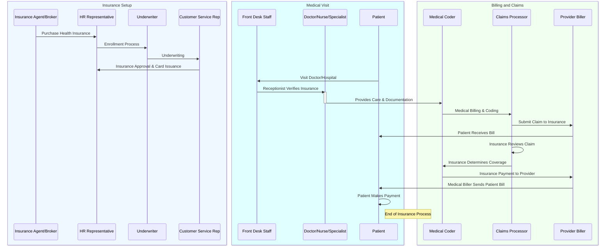

# Health Insurance Process Flow: From Enrollment to Payment

This is an explaination on the entire process involved in health insurance, starting from purchasing a policy to making the final payment.
This is a guide through each step using a sequence diagram and explain the roles of various participants involved in the process.

## Steps Involved

The process is divided into three main sections:

1. **Insurance Setup**
2. **Medical Visit**
3. **Billing and Claims**

### 1. Insurance Setup

The first part of the process involves setting up the health insurance coverage. Here’s how it works:

#### Roles:
- **Insurance Agent/Broker** (A): Helps you select the right insurance plan based on your needs.
- **HR Representative** (B): If insurance is provided by your employer, the HR team helps you enroll.
- **Underwriter** (C): Reviews your information to assess risk and eligibility for coverage.
- **Customer Service Rep** (D): Provides customer support during the enrollment process and helps resolve any questions.

#### Flow:
1. **Purchase Health Insurance**: The process begins with you purchasing insurance, either directly or through an employer.
2. **Enrollment Process**: Once you decide on the plan, the HR representative or insurance agent helps you fill out the necessary forms.
3. **Underwriting**: The insurance company reviews your medical history, lifestyle, and other details to approve the insurance.
4. **Insurance Approval & Card Issuance**: After underwriting, the insurance company issues your health insurance card.

---

### 2. Medical Visit

Once your insurance is set up, the next step is visiting a doctor or hospital for treatment.

#### Roles:
- **Front Desk Staff** (E): Manages patient check-in and verifies insurance details.
- **Doctor/Nurse/Specialist** (F): Provides medical care based on your needs.
- **Patient** (J): Receives the treatment or care.

#### Flow:
1. **Visit Doctor/Hospital**: You go to the healthcare provider for a medical consultation or treatment.
2. **Receptionist Verifies Insurance**: The front desk staff verifies your insurance details to ensure you're covered for the visit.
3. **Provides Care & Documentation**: The healthcare provider (doctor, nurse, etc.) offers the necessary treatment and documents the care provided, using medical codes for billing purposes.

---

### 3. Billing and Claims

After receiving care, the billing process begins. This involves coding, submitting claims to the insurance company, and finalizing the payment.

#### Roles:
- **Medical Coder** (G): Codes the medical services provided based on industry standards (ICD-10, CPT codes).
- **Claims Processor** (H): Reviews claims submitted by the medical coder, ensures they meet insurance standards, and determines what is covered.
- **Provider Biller** (I): Submits the claim to the insurance company and sends you the bill for any remaining charges after insurance coverage.

#### Flow:
1. **Medical Billing & Coding**: After receiving treatment, the healthcare provider's medical coder documents the care using standardized medical codes.
2. **Submit Claim to Insurance**: The claim is sent to the insurance company for review.
3. **Insurance Reviews Claim**: The insurance company checks the submitted claim against your policy to determine the coverage amount.
4. **Insurance Determines Coverage**: The insurance company decides how much of the bill is covered based on your policy and treatment.
5. **Insurance Payment to Provider**: The insurance company sends the payment to the healthcare provider for the covered amount.
6. **Medical Biller Sends Patient Bill**: The provider sends you a bill for any outstanding charges, such as deductibles or co-pays.
7. **Patient Makes Payment**: You pay the remaining balance on your bill, completing the process.

---

## Visualizing the Process

Here’s a **Mermaid sequence diagram** that visualizes the flow of the entire health insurance process. You can embed it in your Markdown file or use it as a reference.

---

## Key Takeaways

- **Insurance Setup** involves selecting a plan, underwriting, and card issuance.
- **Medical Visit** requires verifying insurance details and receiving care.
- **Billing and Claims** focuses on medical coding, claims processing, and payment.

This flow ensures that both the healthcare provider and the patient are
