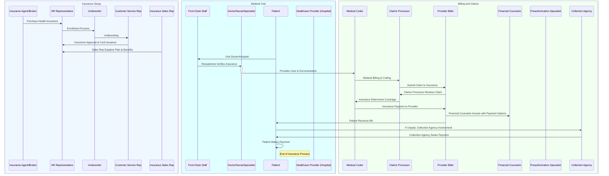

# Complete Guide to Health Insurance and Medical Billing

This guide provides a comprehensive breakdown of how health insurance works from the moment you sign up for a plan all the way to paying your medical bills.
It is aimed towards someone who is trying to understand how healthcare and insurance work together.

## **Step 1: Purchasing Health Insurance**

### **Roles Involved**:
- **Insurance Agent/Broker**: This person helps you find and sign up for an insurance plan that best suits your needs.
- **HR Representative**: If you’re buying insurance through your employer, HR will assist with enrollment.

### **What Happens**:
1. **Research**: You start by researching available insurance plans. These may come from your employer (if offered) or be purchased directly from an insurance company or through a government exchange.
2. **Choosing a Plan**: Once you find a plan, an **Insurance Agent** or **HR Representative** helps explain the details of the plan (such as premiums, deductibles, and coverage limits).
3. **Enrollment**: You complete the necessary paperwork and provide any required documents to **HR** or directly to the insurance company to enroll.
4. **Card Issuance**: Once enrolled, you receive your **insurance card** which you’ll present during medical visits.

---

## **Step 2: Visiting the Doctor/Hospital**

### **Roles Involved**:
- **Front Desk Staff**: At the hospital or doctor's office, they verify that you have valid insurance before your appointment.
- **Doctor/Nurse/Specialist**: They provide the medical care and document the services you received.

### **What Happens**:
1. **Scheduling the Visit**: You schedule an appointment with your doctor or a specialist, either for a routine check-up or for treatment.
2. **Verifying Insurance**: Upon arrival at the doctor’s office, the **front desk staff** will check your insurance details, either through a physical card or electronically.
3. **Receiving Care**: You then meet with the **doctor/nurse** who provides medical care and records the details of your visit, including the diagnosis and any treatments (e.g., tests, prescriptions).
4. **Documentation**: The **doctor** will use specific medical codes (ICD codes for diagnoses and CPT codes for treatments) to document the services provided.

---

## **Step 3: Medical Billing and Claims Processing**

### **Roles Involved**:
- **Medical Coder**: Responsible for coding your medical visit using the correct codes for diagnoses and procedures.
- **Claims Processor**: They review and process the claim sent to the insurance company.
- **Provider Biller**: They submit the claim to your insurance company for payment.
- **Insurance Fraud Investigator**: If there’s a suspicion of fraud, this person investigates the claim.

### **What Happens**:
1. **Coding the Visit**: After your visit, the **medical coder** reviews the medical records and assigns the appropriate codes for the treatment you received.
2. **Submitting the Claim**: The **provider biller** (or hospital staff) then submits this coded information to your insurance company for payment.
3. **Review by Insurance**: The **claims processor** at the insurance company reviews the claim to verify that the services are covered and meet the criteria for payment.
4. **Insurance Payment**: After the insurance company processes the claim, they determine how much of the treatment is covered, and they send payment to the healthcare provider. This is based on your plan’s benefits, network status, and coverage limits.

---

## **Step 4: Receiving and Paying the Bill**

### **Roles Involved**:
- **Financial Counselor**: If there are any out-of-pocket expenses (deductibles, copayments, coinsurance), they help you understand how to manage them.
- **Collection Agency**: If the bill isn’t paid on time, a collection agency may be involved.

### **What Happens**:
1. **Receiving the Bill**: After the insurance payment is processed, the healthcare provider sends you the remaining bill. This could be for your deductible, co-pays, or any portion of the treatment not covered by your insurance.
2. **Understanding the Charges**: A **financial counselor** may be available to explain any confusing charges or work out a payment plan with you if you can’t pay the full amount at once.
3. **Paying the Bill**: You then pay the remaining balance, either directly to the provider or via an online payment portal.
4. **Debt Collection**: If the bill is not paid within a certain period, the healthcare provider might send the unpaid balance to a **collection agency**.

---

## **Other Considerations in the Health Insurance Process**

### **Roles Involved**:
- **Patient Advocate**: A **patient advocate** helps you navigate the complex insurance process, especially if you have trouble understanding the claims, billing, or coverage details.
- **Pharmacy Benefit Manager (PBM)**: If prescriptions are part of your treatment, a **PBM** manages drug coverage and formulary restrictions.

### **Additional Steps**:
1. **High-Deductible Health Plans (HDHP) & HSA**: If you have a high-deductible health plan, you may be responsible for a higher initial cost, but you may also have access to a **Health Savings Account (HSA)** to help cover the deductible.
2. **Out-of-Network Care**: If you see a doctor or facility that is not part of your insurance network, your insurance may not cover as much, and you may end up paying more out-of-pocket.
3. **Secondary Insurance**: If you have a secondary insurance plan, this can reduce what you have to pay out of pocket. Coordination of benefits determines which plan pays first.
4. **Pre-authorization**: For certain treatments, your insurance may require **pre-authorization** or prior approval before they’ll pay. This is often necessary for high-cost treatments or procedures.

---

## Visualizing the Process

Here’s a **Mermaid sequence diagram** that visualizes the flow of the entire health insurance process. You can embed it in your Markdown file or use it as a reference.

### **Key Takeaways**:
- **Health Insurance Enrollment**: This is the first step. You’ll work with an agent or your HR department to choose the right plan for your needs.
- **Medical Visit**: You see your doctor or healthcare provider, who will verify your insurance and document the services.
- **Claims Process**: Your healthcare provider submits a claim to your insurance, which reviews and processes it.
- **Bill Payment**: Once insurance payments are made, you’ll receive a bill for the remaining balance, which you can pay off. If there’s an issue with the payment, a collection agency may get involved.
- **Roles and Assistance**: There are various people (financial counselors, patient advocates, claims processors) who can help if you run into confusion or problems during the process.

### **Final Thoughts**:
Navigating health insurance can be complex, but understanding the roles involved and the process can give you more confidence when dealing with your insurance provider and medical bills. The key is to stay organized, ask questions when you’re unsure, and get assistance from those who are there to help you—like **financial counselors** or **patient advocates**.
