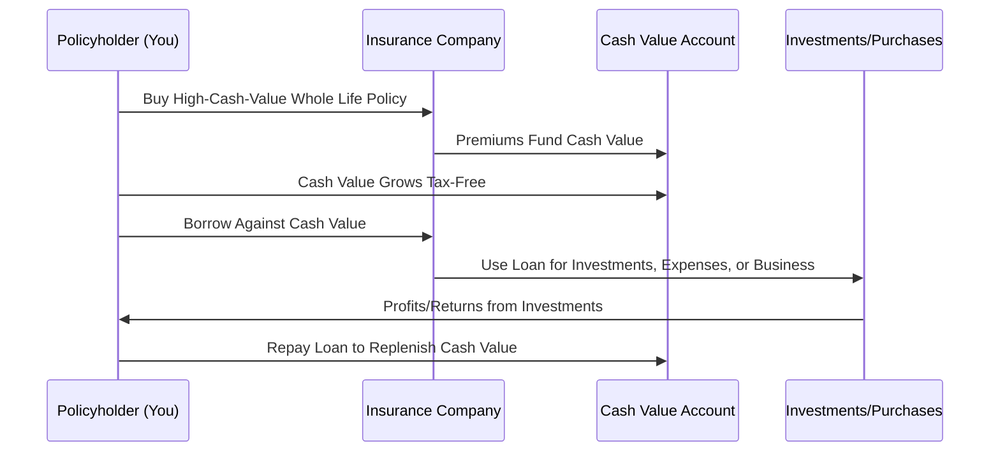
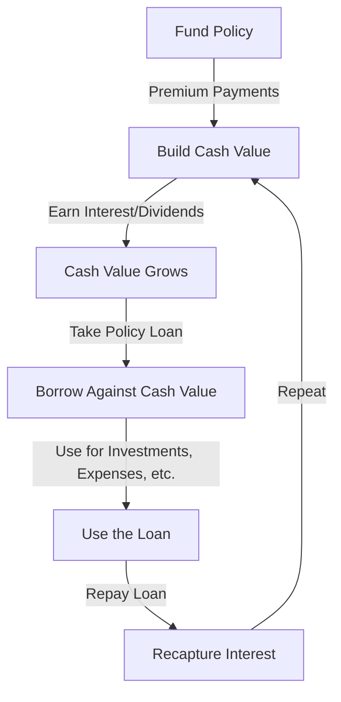
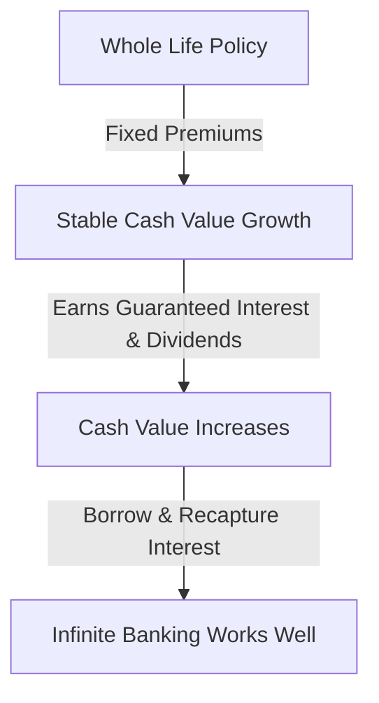
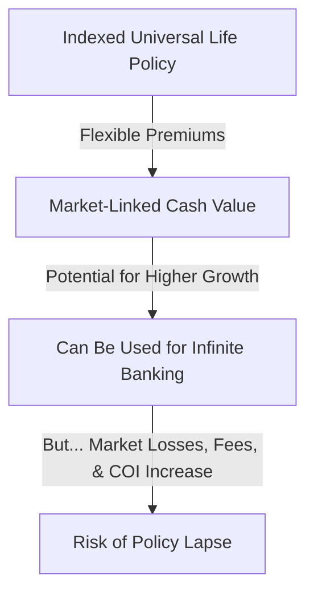
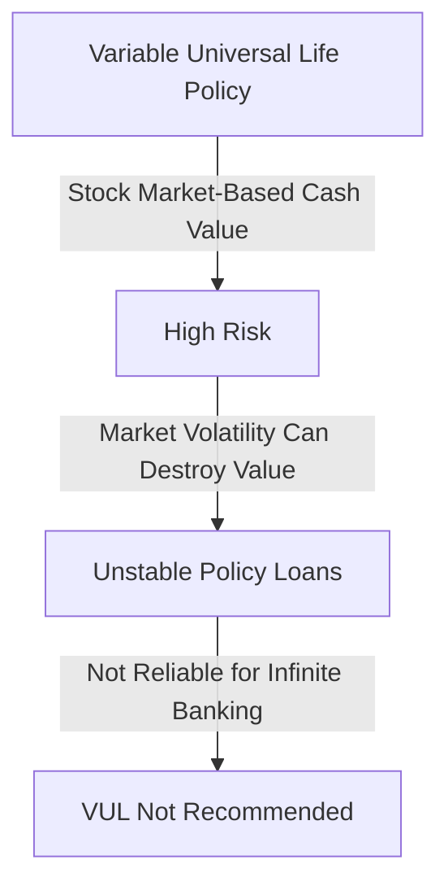
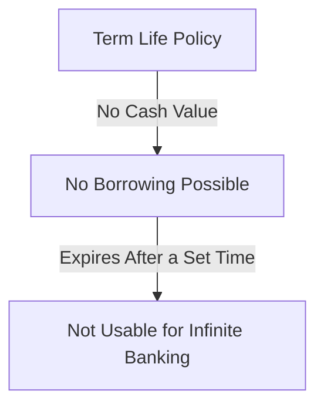

# **Infinite Banking & Life Insurance: A Strategic Guide**

Infinite Banking is a financial strategy that leverages the **cash value of a whole life insurance policy** as a personal banking system. This section explains how it works, its benefits, risks, and how to implement it properly.

----------

## **What is Infinite Banking?**

Infinite Banking is the concept of **using a high-cash-value whole life insurance policy** to build wealth and access funds **tax-free** through policy loans. Instead of borrowing from banks or financial institutions, you borrow from yourself—using the cash value of your life insurance policy as collateral.

### **Approach towards buying a policy: Step-by-Step**

### **Key Components of Infinite Banking**

-   **Whole Life Insurance Policy** – A specially designed policy with **high early cash value growth**.
-   **Cash Value** – The savings portion of the policy that **grows tax-deferred** and can be borrowed against.
-   **Policy Loans** – Loans taken from the insurance company, using the policy’s cash value as collateral. These loans do not trigger **taxable events**.
-   **Loan Repayment** – You can **pay yourself back** with interest, keeping the money growing inside the policy.

----------

## **Benefits of Infinite Banking**

✅ **Tax-Free Growth** – The cash value inside your policy grows tax-deferred.

✅ **Liquidity & Control** – You can access your cash value anytime for **investments, expenses, or emergencies**.

✅ **No Loan Approval Needed** – Unlike traditional loans, policy loans require **no credit check** or approval process.

✅ **Guaranteed Growth** – Whole life policies provide **guaranteed cash value accumulation**.

✅ **Interest Recapture** – Instead of paying banks interest on loans, you **pay yourself back**, keeping money within your financial system.

✅ **Asset Protection** – In many states, cash value in life insurance is protected from **creditors and lawsuits**.

✅ **Legacy Planning** – Provides a **tax-free death benefit** to your beneficiaries.

----------

## **Potential Risks & Drawbacks**

❌ **High Initial Costs** – Whole life insurance premiums are higher than term life, requiring a long-term commitment.

❌ **Slow Cash Value Growth (Initially)** – It can take **5-10 years** before the policy builds significant cash value.

❌ **Loan Interest Still Applies** – Even though you borrow from yourself, the insurance company charges **interest on loans**. However, your cash value **still earns interest and dividends**.

❌ **Requires Discipline** – To maximize benefits, you must **repay loans** and **keep funding the policy** consistently.

----------

# **Infinite Banking vs. Traditional Banking**

| Feature              | Infinite Banking                 | Traditional Banking            |
|----------------------|-----------------------------------|--------------------------------|
| **Loan Approval**     | No approval required              | Requires credit check          |
| **Interest Paid To**  | Yourself (recaptured interest)    | The bank                       |
| **Cash Growth**       | Guaranteed + Dividends            | Minimal (savings accounts)     |
| **Tax Treatment**     | Tax-free growth & withdrawals     | Taxable interest income        |
| **Control**           | Full control over funds           | Subject to bank restrictions   |
| **Asset Protection**  | Protected in many states          | Exposed to creditors           |
| **Death Benefit**     | Yes, tax-free                     | No benefit                     |

----------

## **Real-Life Use Cases of Infinite Banking**

💰 **Entrepreneurs** – Fund businesses without dealing with banks.

🏡 **Real Estate Investors** – Use policy loans to buy rental properties, then repay the loan with rental income.

📈 **Stock Market Investors** – Use borrowed funds to buy stocks while keeping cash value growing.

📚 **Education Expenses** – Pay for a child’s college education and recapture interest.

💳 **Debt Payoff** – Consolidate high-interest debt using tax-free policy loans.

----------

## **How Infinite Banking Works**

Infinite Banking is a **strategy to become your own banker** by using a **cash value life insurance policy** to store, grow, and borrow money **tax-free**.

But **not all life insurance policies work well** for Infinite Banking.

✅ **Best Option:** Whole Life Insurance (WL)  
⚠️ **Possible but Risky:** Indexed Universal Life (IUL)  
❌ **Not Recommended:** Variable Universal Life (VUL), Term Life

Infinite Banking follows a **cycle of funding, borrowing, and repaying**, allowing you to use your own money instead of banks.

### **Key Benefits of Infinite Banking**

✅ **Grow Wealth Safely** – Your money compounds tax-free.  
✅ **Use Your Money Anytime** – Policy loans provide liquidity.  
✅ **Earn Interest While Borrowing** – Cash value keeps growing even when borrowed.  
✅ **No Credit Checks or Bank Control** – You control the borrowing terms.

----------

# **Comparison of Policy Types for Infinite Banking**

| Feature                     | Whole Life (WL)               | Indexed Universal Life (IUL)   | Variable Universal Life (VUL)  | Term Life                     |
|-----------------------------|-------------------------------|--------------------------------|--------------------------------|-------------------------------|
| **Guaranteed Cash Value?**   | ✅ Yes                        | ❌ No                          | ❌ No                          | ❌ No                          |
| **Dividends?**               | ✅ Yes (with mutual companies) | ❌ No                          | ❌ No                          | ❌ No                          |
| **Market Exposure?**         | ❌ No                         | ✅ Yes (Index-Based)           | ✅ Yes (Stock Market)          | ❌ No                          |
| **Premium Flexibility?**     | ❌ No (Fixed)                 | ✅ Yes (Adjustable)            | ✅ Yes (Adjustable)            | ✅ Yes                         |
| **Loan Interest Recapture?** | ✅ Yes                        | ⚠️ Sometimes                   | ⚠️ Sometimes                   | ❌ No                          |
| **Best for Infinite Banking?**| ✅ Ideal                      | ⚠️ Risky                       | ❌ Not Recommended             | ❌ Not Usable                  |

----------

## **Infinite Banking with Whole Life (Best Option ✅)**

🔹 **Why It Works Best:**  
✅ **Guaranteed cash value growth** (safe, predictable).  
✅ **Dividends from mutual insurance companies** (extra earnings).  
✅ **Stable policy loans** (cash value unaffected by market fluctuations).  
✅ **Non-direct recognition options** (cash value still earns interest even when borrowed).

🔹 **Downsides:**

-   **Higher initial cost** (premiums are expensive compared to term/IUL).
-   **Slow cash value growth in early years** (requires proper structuring).

✅ **Best for long-term Infinite Banking strategy.**

----------

## **Infinite Banking with IUL (Risky ⚠️)**

🔹 **Why It Can Work (But Not Ideal):**  
✅ **Potential for higher returns** (if market performs well).  
✅ **Premium flexibility** (can adjust payments over time).

🔹 **Why It’s Risky:**  
⚠️ **No guaranteed cash value** (market downturns can reduce growth).  
⚠️ **Increasing insurance costs** (COI rises over time, eating into cash value).  
⚠️ **Loans may not work well** (indexed loans depend on market growth).  
⚠️ **If the market crashes, you can lose cash value and the policy could lapse.**

⚠️ **Not recommended for Infinite Banking unless carefully structured.**

----------

## **Infinite Banking with Variable Universal Life (VUL) (Not Recommended ❌)**

🔹 **Why It Fails for Infinite Banking:**  
❌ **Cash value depends on stock market** (high risk, no guarantees).  
❌ **Market downturns can wipe out savings.**  
❌ **Unstable policy loans** (loan rates fluctuate).  
❌ **High fees** (management costs eat into returns).

❌ **Too much risk—poor choice for Infinite Banking.**

----------

## **Infinite Banking with Term Life (Impossible ❌)**

🔹 **Why It Doesn’t Work:**  
❌ **No cash value** (purely a death benefit).  
❌ **Can’t borrow against it** (no banking function).  
❌ **Expires after a term (10-30 years)** (no long-term benefits).

❌ **Not applicable for Infinite Banking.**

----------

## **How to Structure the Best Policy for Infinite Banking**

To maximize Infinite Banking benefits, **your policy must be structured correctly**:

✅ **Use Whole Life Insurance** (with a mutual insurance company).  
✅ **Select a Non-Direct Recognition policy** (so borrowed cash value still earns dividends).  
✅ **Overfund with Paid-Up Additions (PUAs)** (accelerates cash value growth).  
✅ **Minimize fees** (ensure low cost-of-insurance charges).  
✅ **Use as a long-term strategy** (requires consistent premiums).

----------
### **Comprehensive Guide to Structuring a Whole Life Policy for Infinite Banking**

Infinite Banking is a long-term financial strategy that leverages the cash value of a **whole life insurance policy** to build wealth and access capital. The idea is to create a **self-financing system** using a life insurance policy, providing you with the ability to borrow against it, invest, or grow your wealth over time. The key to success in Infinite Banking lies in structuring your policy for **maximum cash value accumulation**, **minimal fees**, and **strong long-term growth**.

Here’s how to effectively structure a Whole Life Policy for Infinite Banking:

----------

### **1. Maximize Paid-Up Additions (PUAs)**

#### What Are Paid-Up Additions (PUAs)?

-   **Paid-Up Additions** (PUAs) are additional insurance purchased on top of your base whole life policy. These additions increase both your **death benefit** and **cash value**.
-   The cash value of PUAs grows **tax-deferred**, much like the base policy, and can be used for loans or withdrawals.

#### Why Are PUAs Crucial?

-   PUAs **accelerate the growth** of your cash value, providing you with more access to funds in the early years of the policy.
-   They **increase liquidity**, making it easier to take out loans or make withdrawals when needed.
-   By increasing both your death benefit and cash value, PUAs help create a **larger financial pool** over time, which is essential for the success of Infinite Banking.

#### Recommendations:

-   Structure your policy to **maximize Paid-Up Additions** while staying within **IRS guidelines** to avoid turning your policy into a Modified Endowment Contract (MEC).
-   This will **boost the cash value accumulation** in the early years of the policy and allow you to use it effectively as your personal banking system.

----------

### **2. Minimize Fees and Costs**

#### Understanding Fees in Whole Life Policies:

-   Whole life policies come with various **administrative fees**, **mortality charges**, and **cost-of-insurance** charges that can reduce the amount of premium money directed toward your policy’s cash value.

#### Why Minimizing Fees is Key:

-   Minimizing these costs ensures that a **larger portion of your premiums** goes toward the growth of your cash value rather than paying for overhead expenses and insurance charges.
-   It’s crucial to focus on a policy design that **reduces unnecessary costs** to increase your **cash value** and **liquidity**.

#### Recommendations:

-   Work with an expert who can help **optimize the policy design** to reduce unnecessary fees, particularly in the first few years when the policy's cash value is growing slowly.
-   Consider a policy that focuses on **high cash value accumulation** instead of a **large death benefit**, as this can lead to higher fees.

----------

### **3. Focus on Long-Term Wealth Accumulation**

#### Why a Long-Term Strategy Works:

-   Infinite Banking relies on the **compounding growth** of cash value, which takes time. The **early years** of a whole life policy may not show immediate large returns because of initial fees and the time required to build cash value.

#### How to Maximize Long-Term Growth:

-   Treat your whole life policy as a **long-term wealth-building tool** that grows over decades. This way, you can avoid the temptation of short-term gains and let your cash value grow at a steady pace.
-   The **longer the time horizon**, the more **compounding** benefits you can leverage, leading to substantial growth in both your **cash value** and **death benefit**.

#### Recommendations:

-   Avoid using your policy for short-term financial goals. Instead, think of it as a **multi-decade financial system** to build wealth, access liquidity, and provide for future needs.
-   The real benefits of Infinite Banking come from the **steady, long-term accumulation** of cash value, which allows for consistent access to capital.

----------

### **4. Avoid Policies with Excessive Risk or Uncertainty**

#### Types of Policies to Avoid:

-   **Indexed Universal Life (IUL):** These policies are tied to market indexes, making them **volatile** and unpredictable. While they may offer high returns in good market conditions, the fees and risk exposure can reduce the policy's cash value in the long term.
    
-   **Variable Universal Life (VUL):** VUL policies are linked to **mutual funds**, which can fluctuate wildly. The associated market risks make it harder to guarantee the steady growth needed for Infinite Banking.
    

#### Why Avoid These Policies?

-   Both IULs and VULs introduce **unnecessary market risk** and **high fees**, which can eat into the growth of your cash value. They also require careful monitoring and may not be suitable for long-term wealth building.

#### Recommendations:

-   Stick to a **whole life policy** with a **guaranteed cash value** growth structure. Whole life policies offer **predictable** and **stable** returns, ideal for Infinite Banking.

----------

### **5. Leverage Policy Loans Effectively**

#### How Policy Loans Work:

-   Whole life policies allow you to **borrow against the cash value** of the policy at a relatively low-interest rate. However, it's important to **understand the terms** of your loans to avoid reducing your death benefit or running into issues with repayment.

#### Why Policy Loans Are Essential for Infinite Banking:

-   Policy loans can provide you with access to **capital** for investment, large purchases, or debt consolidation. The loan interest is generally lower than traditional loans, and you’re borrowing from your own money.

#### Recommendations:

-   Use policy loans sparingly and ensure you **repay them** on time to avoid diminishing your cash value or death benefit.
-   **Keep track of loan balances** to ensure the interest doesn’t compound and reduce the policy’s overall performance.

----------

### **6. Utilize Dividends to Boost Cash Value**

#### What Are Dividends?

-   Some whole life policies pay **dividends**, which can be reinvested to purchase additional **Paid-Up Additions**, increasing your cash value even further. Dividends are typically based on the performance of the insurance company’s investments.

#### Why Dividends Matter:

-   Dividends provide a way to **boost your cash value** without additional out-of-pocket contributions.
-   They can be used to **accelerate your policy's growth**, purchase more Paid-Up Additions, or reduce your premium payments.

#### Recommendations:

-   Choose a whole life policy from an **insurance company with a strong dividend-paying history** to maximize this benefit.
-   Reinvest dividends into **Paid-Up Additions** to **further accelerate** the growth of your policy’s cash value.

----------

All of this **"Infinite Banking"** stuff only works **IF**:

1. **You Stick to a Long-Term Plan** – Infinite Banking requires consistent funding and patience. The strategy isn't a quick fix; it’s about building wealth over time. If you’re not committed to maintaining the policy for several years (typically 10+), you won’t see the cash value growth needed to leverage the system effectively.

2. **You Can Afford the Higher Premiums** – Whole Life insurance premiums are generally much higher than Term Life. If you're not in a financial position to handle the initial costs, this strategy might be difficult to sustain. You need to ensure that your budget allows for the premiums without straining your finances.

3. **You Properly Structure the Policy** – Not all Whole Life insurance policies are created equal. To maximize the benefits of Infinite Banking, the policy must be structured with the right features, such as Paid-Up Additions (PUAs) and non-direct recognition loans. These features help accelerate the growth of cash value and ensure your money continues to earn while you borrow.

4. **You’re Disciplined About Repaying Loans** – One of the biggest advantages of Infinite Banking is the ability to borrow against your policy. However, to truly benefit from this system, you must be diligent about repaying the loans, including interest. If you don't stay on top of repayments, your cash value could dwindle, reducing the long-term potential of your policy.

5. **You Understand the Risks** – Like any financial strategy, there are risks involved. For instance, while cash value grows tax-deferred, it's not immune to fees and market fluctuations (in the case of IULs). If you don’t monitor the policy closely or mismanage your withdrawals and loans, it could lapse or underperform. You must approach Infinite Banking with a clear understanding of the risks involved.

6. **You Have a Backup Plan** – Life can be unpredictable. If your financial situation changes, or if the policy doesn’t perform as expected, you need a contingency plan. Having a backup plan ensures that you’re not left in a vulnerable situation if things don't go as planned.

7. **You Account for Inflation** – Inflation erodes purchasing power over time, which could affect the long-term value of your cash value accumulation. While Whole Life policies do have guaranteed growth, the returns may not outpace inflation, especially if you’re relying on this strategy for retirement or major expenses in the future. If inflation is high, the cash value might not grow fast enough to keep up with rising costs, meaning the real value of your policy could be lower than expected.

8. **The Fees and Charges Can Be High** – Whole Life insurance policies often come with significant fees, especially in the early years. These can include administrative fees, mortality charges, and cost of insurance. In some cases, the majority of your premium in the first few years might go toward these costs rather than building cash value, which can delay the benefits you would receive from the policy.

9. **Slow Cash Value Growth Early On** – While you can access the cash value of your policy, the growth is typically slow in the initial years. It may take a decade or more before the cash value begins to grow substantially, which might not be ideal for those looking for quicker returns or using the system in emergencies.

10. **Complexity and Misunderstanding** – The Infinite Banking concept is complex, and many people don’t fully understand how it works. Misunderstanding the mechanics of how loans, interest, and dividends interact with the policy could lead to underperformance or mismanagement. Without expert guidance or consistent monitoring, you might miss out on the full potential of your policy.

----------

# **NOT FINANCE ADVICE!!!**
None of this is financial advice; not something I'm doing either. It's just documentations of things I have learnt over the years.
