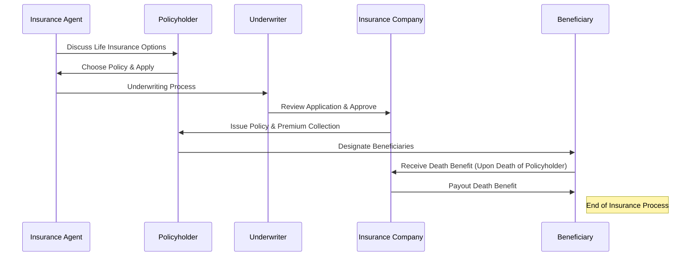

# **Complete Guide to Life Insurance Policies**

This guide provides a clear explanation of life insurance, its purpose, and the various types of policies available. Whether you’re new to life insurance or need a refresher, this guide will walk you through everything you need to know.

----------

## **Step 1: Understanding Life Insurance**

### **What is Life Insurance?**

Life insurance is a contract between you (the policyholder) and an insurance company. In exchange for regular premium payments, the insurer provides a **death benefit** (a lump sum of money) to your beneficiaries when you pass away.

**Why Do People Buy Life Insurance?**

-   Replace lost income for dependents
-   Pay off debts (mortgage, loans, credit cards)
-   Cover funeral and end-of-life expenses
-   Build wealth or leave an inheritance
-   Fund business continuity plans
-   Provide financial security for loved ones

**Who Are the Key Players in Life Insurance?**

-   **Policyholder** – The person who owns the life insurance policy
-   **Insured** – The person whose life is insured (may be the same as the policyholder)
-   **Beneficiary** – The person(s) or entity that receives the payout
-   **Insurance Company** – The company that provides the policy and pays out claims
-   **Insurance Agent/Broker** – Helps the policyholder choose a suitable policy
-   **Underwriter** – Evaluates risk and determines premiums

----------

## **Step 2: Choosing the Right Life Insurance Policy**

There are several types of life insurance policies, each designed to meet different needs.

### **1. Term Life Insurance**

**Coverage Duration:** Fixed term (10, 20, or 30 years)  
**Cash Value:** ❌ No cash value  
**Premiums:** Lower than permanent insurance  
**Death Benefit:** Paid if death occurs within the term

✅ **Pros:**

-   Affordable coverage
-   Simple and easy to understand
-   Ideal for temporary needs (e.g., mortgage, raising children)

❌ **Cons:**

-   No cash value accumulation
-   Coverage ends when the term expires

**Best For:** Young families, homeowners, those needing temporary coverage

----------

### **2. Whole Life Insurance**

**Coverage Duration:** Lifetime  
**Cash Value:** ✅ Grows at a guaranteed rate  
**Premiums:** Fixed, higher than term life  
**Death Benefit:** Guaranteed payout

✅ **Pros:**

-   Lifetime coverage
-   Builds cash value over time
-   Can borrow against cash value

❌ **Cons:**

-   More expensive than term life
-   Returns on cash value may be low

**Best For:** Estate planning, lifelong financial security, wealth building

----------

### **3. Universal Life Insurance (UL)**

**Coverage Duration:** Lifetime  
**Cash Value:** ✅ Earns interest (varies with market rates)  
**Premiums:** Flexible (adjustable payments)  
**Death Benefit:** Adjustable

✅ **Pros:**

-   Flexible premiums and death benefits
-   Cash value earns interest

❌ **Cons:**

-   Requires active management
-   Interest rates affect cash value growth

**Best For:** People who want flexibility in coverage and payments

----------

### **4. Index Universal Life Insurance (IUL)**

**Coverage Duration:** Lifetime  
**Cash Value:** ✅ Grows based on stock market index performance  
**Premiums:** Flexible  
**Death Benefit:** Adjustable

✅ **Pros:**

-   Growth potential linked to market performance
-   Downside protection (minimum guaranteed return)
-   Tax-free cash value growth

❌ **Cons:**

-   Caps on maximum returns
-   Fees and complexity can reduce benefits

**Best For:** Individuals seeking flexible, tax-advantaged growth with protection against market downturns

----------

### **5. Variable Life Insurance (VUL)**

**Coverage Duration:** Lifetime  
**Cash Value:** ✅ Invested in stocks, bonds, and mutual funds  
**Premiums:** Flexible  
**Death Benefit:** Adjustable

✅ **Pros:**

-   Higher growth potential compared to other permanent policies
-   Investment flexibility

❌ **Cons:**

-   Market risk—cash value can decrease
-   Requires active management

**Best For:** Investors comfortable with risk who want long-term, tax-advantaged growth

----------

### **6. Final Expense Insurance**

**Coverage Duration:** Lifetime  
**Cash Value:** ✅ Small cash value accumulation  
**Premiums:** Fixed, lower than whole life  
**Death Benefit:** Smaller amounts ($5,000 - $50,000)

✅ **Pros:**

-   Designed to cover funeral and medical expenses
-   No medical exam required (easy approval)

❌ **Cons:**

-   Lower coverage amounts
-   Not suitable for wealth building

**Best For:** Seniors looking to cover funeral and end-of-life costs

----------

### **7. Accidental Death & Dismemberment (AD&D) Insurance**

**Coverage Duration:** Until policy expires  
**Cash Value:** ❌ No cash value  
**Premiums:** Low-cost  
**Death Benefit:** Paid only if death is caused by an accident

✅ **Pros:**

-   Affordable supplemental coverage
-   Pays out for serious injuries (loss of limb, paralysis)

❌ **Cons:**

-   No payout for natural causes or illnesses
-   Limited benefits

**Best For:** Individuals with high-risk jobs or lifestyles

----------

## **Comparison Table of Life Insurance Policies**

| Policy Type         | Duration       | Cash Value            | Premiums  | Death Benefit | Best For |
|---------------------|---------------|-----------------------|-----------|--------------|----------|
| **Term Life**       | 10-30 years    | ❌ None               | Low       | Fixed        | Temporary needs, affordability |
| **Whole Life**      | Lifetime       | ✅ Guaranteed         | High      | Fixed        | Long-term security, wealth building |
| **Universal Life (UL)** | Lifetime  | ✅ Interest-based    | Flexible  | Adjustable   | Flexibility in payments and coverage |
| **Index UL (IUL)**  | Lifetime       | ✅ Linked to market index | Flexible  | Adjustable   | Growth potential with downside protection |
| **Variable UL (VUL)** | Lifetime   | ✅ Market-based investments | Flexible  | Adjustable   | Investors comfortable with risk |
| **Final Expense**   | Lifetime       | ✅ Small              | Moderate  | Fixed        | Funeral and end-of-life expenses |
| **AD&D**           | Until policy expires | ❌ None         | Low       | Accident-only | High-risk occupations, extra coverage |

----------

## **Step 3: The Life Insurance Process**

----------

## **Final Thoughts**

1.  **Term life** = Best for temporary coverage at lower cost.
2.  **Whole life** = Provides lifetime coverage and cash value accumulation.
3.  **Universal life (UL, IUL, VUL)** = Offers flexibility, with different cash value growth options.
4.  **Final Expense** = Affordable, smaller coverage for funeral costs.
5.  **AD&D** = Accident-only coverage, useful as a supplement.

Life insurance is a powerful financial tool that provides peace of mind and financial security. Choosing the right policy depends on your financial goals, risk tolerance, and budget.
