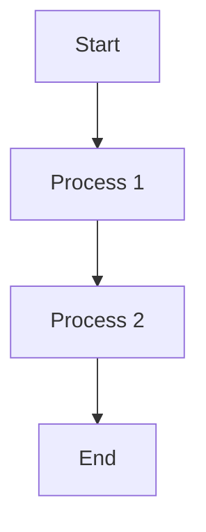

## **Using Mermaid for GitHub**

Mermaid is a JavaScript-based diagramming and charting tool that helps you create diagrams and flowcharts in your Markdown files using simple, human-readable text. GitHub supports Mermaid diagrams directly in `.md` files, making it easy to document workflows, processes, and data structures.

### **Step 1: Writing Mermaid Code**

To use Mermaid on GitHub, simply write the Mermaid code inside a fenced code block with the `mermaid` tag. For example:

```markdown

```

This creates a simple flowchart from "Start" to "End" through two processes. The syntax inside the code block represents the Mermaid diagram.

#### **Mermaid Diagram Types**
Here are some common types of Mermaid diagrams you can create:

1. **Flowcharts**  
   Represent the flow of processes or events.
   ```mermaid
   graph LR
       A[Start] --> B[Process 1]
       B --> C[Process 2]
       C --> D[End]
   ```

2. **Sequence Diagrams**  
   Depict interactions between different components or users.
   ```mermaid
   sequenceDiagram
       Alice->>John: Hello John, how are you?
       John-->>Alice: Great! How about you?
   ```

3. **Gantt Charts**  
   Useful for project planning and timelines.
   ```mermaid
   gantt
       title A Gantt Diagram
       dateFormat  YYYY-MM-DD
       section Section
       A task           :a1, 2025-02-01, 30d
       Another task     :after a1  , 20d
   ```

4. **Class Diagrams**  
   Useful for representing object-oriented systems and relationships.
   ```mermaid
   classDiagram
       Animal <|-- Dog
       Animal <|-- Cat
       Dog : +bark()
       Cat : +meow()
   ```

5. **Pie Charts**  
   Represent data distribution visually.
   ```mermaid
   pie
       title Pie Chart Example
       "Apple" : 30
       "Banana" : 60
       "Cherry" : 10
   ```

### **Step 2: Rendering Mermaid Diagrams on GitHub**

Once you've written your Mermaid code, simply push the Markdown file (`.md`) to your GitHub repository. GitHub automatically renders the Mermaid code as diagrams when you view the file.

### **Step 3: Previewing and Debugging**

If you want to test and preview your Mermaid diagrams before pushing them to GitHub, you can use tools like:

- **[mermaid.live](https://mermaid-js.github.io/mermaid-live-editor/)**: An online live editor to quickly preview and adjust your Mermaid diagrams. Simply paste your Mermaid code here, and it will render the diagram.
  
- **[Mermaid Chart](https://mermaidchart.com/)**: Another simple tool for writing and previewing Mermaid diagrams. It supports a variety of charts, such as flowcharts, Gantt charts, and more.

### **Step 4: Using GitHub Actions (Optional)**

If you want more control over your Mermaid diagrams or automate their generation, you can integrate Mermaid with GitHub Actions. By setting up an action, you can automatically render diagrams and update them based on changes to your Markdown files.

### **Step 5: Alternatives to Mermaid**

Here are some other tools you can consider:

1. **PlantUML**  
   A powerful tool for generating UML diagrams using a simple textual description. It supports many diagram types and can integrate with GitHub using PlantUML renderers or third-party plugins.

   ```plantuml
   @startuml
   Alice -> Bob : Hello
   Bob -> Alice : Hi!
   @enduml
   ```

2. **Graphviz**  
   Graphviz is another popular tool for creating diagrams and flowcharts. It uses the DOT language to define graphs. You can use Graphviz with Markdown on GitHub, though it might require external services or integration with CI/CD tools.

3. **Excalidraw**  
   Excalidraw allows you to draw diagrams manually and export them as images. While it doesn't use textual descriptions, it’s a great tool for creating sketches, wireframes, and flowcharts visually.

4. **Lucidchart**  
   Lucidchart offers a web-based platform for creating various types of diagrams. While it’s not open-source, it integrates well with GitHub and allows exporting diagrams as images that you can embed in your Markdown files.

---

### **Conclusion**

Mermaid is a powerful tool for generating diagrams directly within GitHub repositories using Markdown. By using simple text-based code, you can create flowcharts, sequence diagrams, and many other visual representations to document your project workflows. Additionally, tools like mermaid.live and mermaidchart.com help you preview your diagrams before pushing them to GitHub, and alternatives like PlantUML and Graphviz provide more diagramming options.
