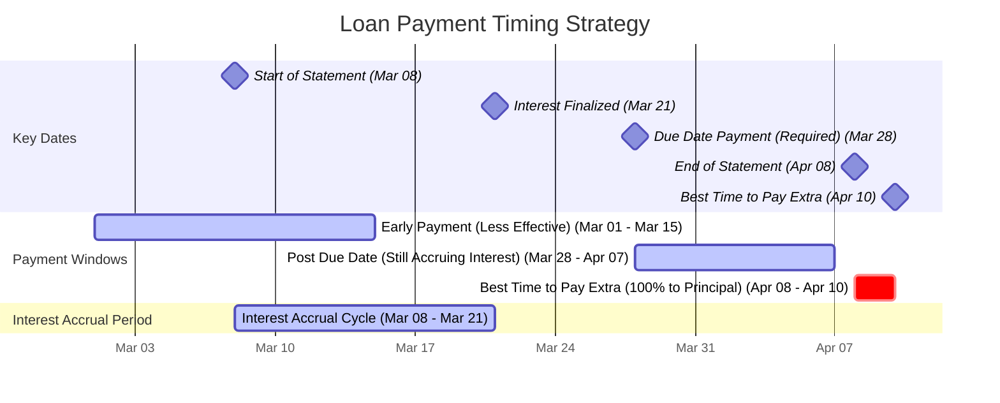

# **Optimal Loan Payment Strategy: Minimizing Interest and Maximizing Principal Repayment**

Managing your loan effectively is crucial for reducing interest and accelerating your path to financial freedom. One of the key strategies for achieving this is understanding **when to make your loan payments** to ensure that they go toward reducing your principal balance instead of covering interest. This guide will walk you through the **timing dynamics** of loan payments and provide **practical examples** to help you take control of your debt.

**Please note:**  
The dates, interest rates, and cycles discussed in this tutorial are **hypothetical examples**. Your own loan statement cycle, payment dates, and interest calculations may differ. It is essential to **check your loan details** and apply the strategies in this guide to your specific loan agreement.

The strategy outlined here is not limited to credit cards—it can be applied to **any type of loan** with an interest accrual system, such as:

-   **Personal loans**
-   **Student loans**
-   **Auto loans**
-   **Mortgages**
-   **Home equity loans**

In fact, it’s often even more impactful on loans like **mortgages** and **auto loans**, where interest is typically charged on a larger balance over a longer period of time.

The key principle is understanding the timing of interest accrual and how payments are applied to both interest and principal. Whether you’re managing a high-interest credit card or a long-term loan, the strategy of paying extra after the statement date (or similar key moments in the loan cycle) can help minimize interest costs and accelerate principal repayment.

----------

## **Visualizing the Payment Timing Strategy**

To better understand the timing of your loan payments, here is a visual representation of the key payment windows and interest accrual cycle:

----------

## **🔹 Step 1: Understanding Loan Interest Accrual**

To reduce the amount of interest you pay over the life of your loan, it’s essential to understand **how interest is applied**.

Most loans **accrue interest daily** but apply it at **specific intervals**. The key dates to focus on include:

1.  **Due Date** – The deadline for your minimum payment, which covers both interest and a portion of the principal (e.g., **March 28th** in this hypothetical example).
2.  **Statement Date** (Post Date) – The date the bank finalizes your **interest charges** for the previous month (e.g., **April 8th** in this hypothetical example).
3.  **Billing Cycle** – The period over which interest accrues (e.g., **March 8th – April 7th** in this example).

📌 **Important Insight**:
The interest accrued between **March 8th and April 7th** will be applied to your loan balance on **April 8th**. **To minimize interest, make extra payments after the statement date** so that your payment goes toward reducing the principal, not paying interest.

----------

## **🔹 Step 2: Identifying the Best Time to Make Extra Payments**

The timing of your payments can significantly impact how much interest you pay. Here’s a breakdown of when payments are most effective:

| **Payment Timing** | **Impact on Loan** |
|-----------------------------------------|--------------------------------------------------------------------------------------------------------------------| 
**Before Due Date (March 1st–27th)** | Reduces your balance, but part of the payment covers the current cycle's interest. |
**On the Due Date (March 28th)** | Covers the required payment (interest + scheduled principal). |
**Between Due Date & Statement Date (March 28th – April 7th)**| Interest is still accruing, so part of the payment covers interest charges. |
**After Statement Date (April 8th – Next Due Date)** | Extra payments go directly to the principal, reducing the future interest charges. ✅

📌 **Best Strategy**:
To maximize the impact of your extra payments, make them after the **statement date** (April 8th) to ensure they go entirely toward the principal.

⚠ **Avoid paying extra before the statement date**, as part of your payment will go toward interest.

----------

## **🔹 Step 3: Example Scenarios of Effective Payment Timing**

### **Scenario 1: Timing Matters – Paying Extra at the Right Moment**

#### Loan Details:

-   **Balance**: $5,000
-   **Interest Rate**: 5% annually
-   **Minimum Payment**: $200
-   **Due Date**: March 28th
-   **Statement Date**: April 8th

#### **Scenario 1A – Paying Extra Too Early (March 26th)**

-   **Payment**: $500
-   **Result**: Since the **March cycle has not yet closed**, some of this payment goes toward the interest charge. Only **$300** reduces the principal.

#### **Scenario 1B – Paying Extra at the Ideal Time (April 10th)**

-   **Payment**: $500
-   **Result**: Since the interest for the previous cycle has already been applied, the full **$500** goes directly to reducing the principal. This lowers the balance and reduces future interest.

----------

### **Scenario 2: The Power of Paying Early vs. Paying Extra**

#### **Scenario 2A – Paying Early (March 1st)**

-   **Impact**: While early payments reduce the balance, **interest will still accrue based on the original loan balance**. The next statement (April 8th) will apply the full interest amount regardless of your early payment.

#### **Scenario 2B – Paying Extra (April 9th)**

-   **Impact**: Since the **statement has already applied interest**, your payment is **entirely applied to the principal**. This reduces the amount on which future interest is calculated, saving you money over time.

----------

## **🔹 Step 4: Verify the Best Time to Pay with Your Loan Account**

To ensure that you are making payments at the optimal time:

1.  **Check Your Balance After the 8th** – If interest has been added to your balance, extra payments will go toward reducing the principal.
2.  **Review Your Statement or Online Account** – Some lenders provide details on **“Interest Charged”** or **“Next Interest Charge Date”**, which can help you determine when to pay.
3.  **Contact Your Lender** – If you're unsure, don’t hesitate to reach out to your lender for clarification on the best time to make extra payments.

----------

## **🔹 Final Takeaways: Key Principles for Effective Loan Repayment**

✅ **Always make at least the minimum payment by the due date (March 28th).**  
✅ **Make extra payments after the statement date (April 8th)** so your payment is 100% applied to the principal.  
✅ **Avoid extra payments before the statement date**, as part of your payment will go toward interest.  
✅ **Review your loan statement** regularly and check for any interest charges to help you plan the optimal timing for your payments.

By following these strategies, you can significantly reduce your loan balance faster, minimize interest over time, and take control of your debt repayment strategy.
